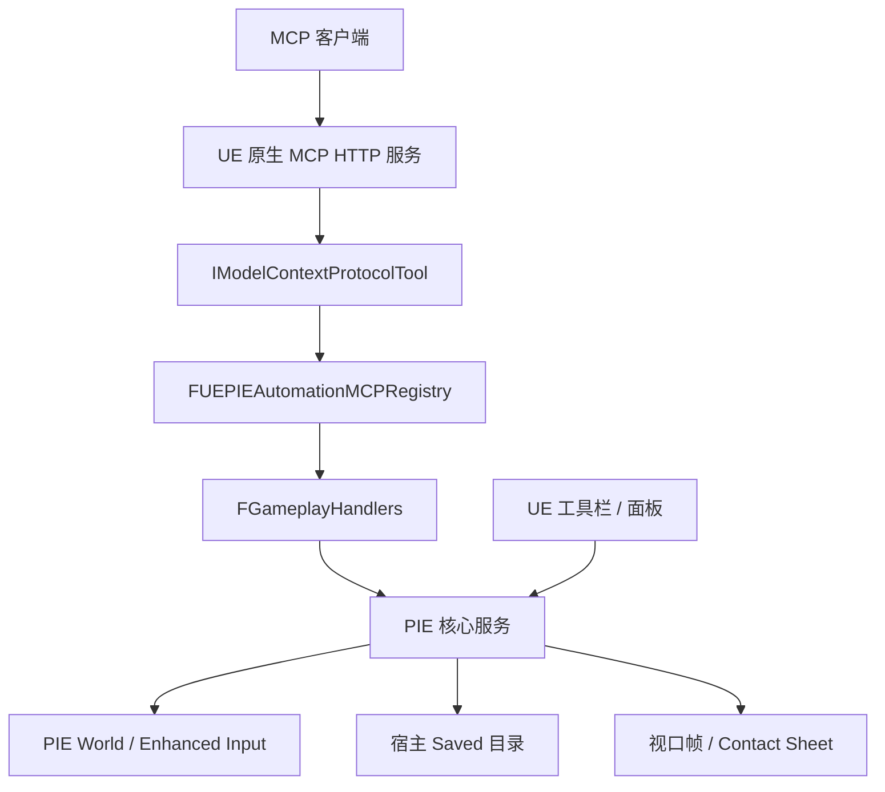

# UE PIE Automation 项目介绍与代码架构

本文按当前仓库源码整理。UE PIE Automation 是 Unreal Engine 5.8 的 Editor 插件，用于录制、回放、观察和诊断 Play-In-Editor 会话。仓库根目录就是插件根目录，下载后可直接放入宿主工程的 `Plugins/` 目录。

## 项目结构

| 路径 | 职责 |
|---|---|
| `UEPIEAutomation.uplugin` | Editor 插件清单，依赖 `ModelContextProtocol`、`EnhancedInput` |
| `Source/UEPIEAutomation/UEPIEAutomation.Build.cs` | UE 模块依赖，包含原生 MCP、编辑器、Slate、JSON 和输入模块 |
| `Source/UEPIEAutomation/Private/UEPIEAutomation.cpp` | 模块启动、PIE 生命周期服务、原生 MCP 注册、编辑器 UI 注册 |
| `Source/UEPIEAutomation/Private/MCP/` | 原生 MCP 工具包装与工具注册表 |
| `Source/UEPIEAutomation/Private/Handlers/` | 参数校验、业务 Handler、资产操作和 JSON 快照序列化 |
| `Source/UEPIEAutomation/Private/PIE/` | 录制、回放、逐帧采样、注入、观察、日志、偏差、捕获和文件格式 |
| `Source/UEPIEAutomation/Private/UI/` | 工具栏按钮和可停靠 UE PIE Automation 面板 |
| `Source/UEPIEAutomation/Private/Tests/` | UE Automation 测试 |
| `Resources/UEPIEAutomationTools.json` | 52 个原生 MCP 工具的描述和输入 JSON Schema |

仓库不再包含 Node/npm 工程，也不要求外部桥接模块。它没有独立 `.uproject`；编译和运行依赖宿主 UE 工程。

## 总体数据流



UE 原生 MCP 负责 HTTP、MCP 握手、工具发现和工具调用。插件只实现 `IModelContextProtocolTool` 包装层：从 `UEPIEAutomationTools.json` 读取描述和参数 schema，把调用切到游戏线程，再转发到原有 Handler。返回值通过 `MakeStructuredContentResult` 保留 JSON 结构；`success=false` 会转换成原生 MCP 的 `isError=true`。

工具名称是 `PIEStudio.<action>`，例如：

```json
{
  "name": "PIEStudio.record_status",
  "arguments": {}
}
```

原生 MCP 的 Tool Search 开启时仍可使用 `list_toolsets`、`describe_toolset` 和 `call_tool`；直接工具也会出现在 `tools/list` 中。插件监听原生 `OnRefreshTools`，因此客户端刷新工具表后会重新注册自身工具。

## 模块关系

`FUEPIEAutomationModule::StartupModule` 初始化输入注入器、录制器、回放器、观察器和会话日志，注册工具栏与面板，再创建 `FUEPIEAutomationMCPRegistry`。关闭模块时先注销 MCP 工具，再清理 PIE 服务。

`FGameplayHandlers` 是稳定的业务边界。录制、回放、观察、日志、捕获、性能、测试、Actor 操作和场景处理代码仍使用原有 `TSharedPtr<FJsonValue> Handler(const TSharedPtr<FJsonObject>&)` 签名；迁移没有把业务状态机改成另一套接口。

本地 `Handlers/HandlerUtils.h`、`HandlerAssetCreate.h` 和 `JsonSerializer.*` 提供原先桥接层承担的最小功能：必填/可选参数读取、成功/错误结果、回滚元数据、PIE 世界和 Actor 查找、资产创建、数组读取以及 BlueprintVisible 属性序列化。这样 Handler 不需要依赖外部桥接头文件。

## 核心执行链路

### 录制

`PIEStudio.record_arm` 调用 `FPIEInputRecorder::Arm`，状态依次为 `Armed → WaitingForPawn → Recording`。采样器绑定 Pawn 后，在帧回调中采集 Enhanced Input、Pawn/动画状态、跟踪属性和性能数据。`record_stop` 或 `EndPIE` 写入：

```text
Saved/MCPRecordings/<id>/
  manifest.json
  sequence.json
  recording.csv
```

### 回放

`replay_arm` 只准备输入序列；`replay_run` 还会请求编辑器启动 PIE。回放器等待 Pawn 和稳定时间，按帧重新注入输入并对比源数据，最终写入 `drift.json`。`replay_status` 是异步流程的状态入口，只有 `pie_active=false` 且 `last_result` 已出现时才代表本次运行结束。

输入回放提升可重复性，但不保证 Chaos、动画、网络和项目逻辑完全确定。`replay_state` 是另一条路径：它直接读取并可应用已记录的 Pawn 状态，不重新模拟完整游戏逻辑。

### 观察、日志和图像

`FPIEObserver` 可以按观察配置创建多个会话，逐帧生成 `observation.csv` 和 `tracked.jsonl`。`FPIESessionLog` 接收 Output Log 和 Blueprint 异常，保存到 `Saved/MCPSessions/<id>/`。`FPIEViewportCapture`、`FPIEContactSheet` 和 `FPIEGifEncoder` 负责 JPEG/PNG 帧、Contact Sheet 和可选 GIF。

### 测试和场景

`test_scaffold`、`test_run`、`assert_eval` 复用录制、偏差和逐帧序列。`scenario_scaffold`、`scenario_validate` 已可用，`FPIEScenario::ApplyArrange` 支持 arrange 执行辅助；完整的 `scenario_run` 编排器目前仍是后续工作，不应当作已公开能力。

## 工具规模与接口

当前 `Resources/UEPIEAutomationTools.json` 与 C++ Handler 表各包含 52 个工具：输入注入 5 个、录制 8 个、回放/分析 7 个、测试/断言 4 个、差异/快照 2 个、Actor 4 个、场景 2 个、观察配置 5 个、观察会话 6 个、运行时检查 3 个、日志 2 个、性能 3 个、独立捕获 1 个。

新增动作需要同时完成三件事：在 `GameplayHandlers.h/.cpp` 中实现 Handler；在 `UEPIEAutomationMCPRegistry.cpp` 加入函数指针映射；在 `Resources/UEPIEAutomationTools.json` 加入同名工具和输入 schema。工具名使用 `PIEStudio.<action>`，Handler 内部仍使用裸 action 名。

## 验证记录

本次使用目录 Junction 将仓库安装到：

```text
E:/Workspace/_UE/Blank_5_8/Plugins/UEPIEAutomation
```

UE 5.8 Editor target 编译通过。`UEPIEAutomation` Automation suite 找到并通过 11 个测试。原生 MCP 端点完成 initialize 握手，`tools/list` 返回 52 个 UE PIE Automation 工具及 schema；`record_status` 返回结构化 JSON，缺少 `record_read.id` 时返回 `isError=true`。随后通过同一个 MCP 端点启动 PIE、录制 351 帧、停止录制并回放，生成 `drift.json`，比较帧数为 351。

验证工程的原生 MCP 服务地址为 `http://127.0.0.1:8000/mcp`；其他编辑器占用端口时可使用 `-ModelContextProtocolPort=<port>`。
